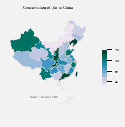
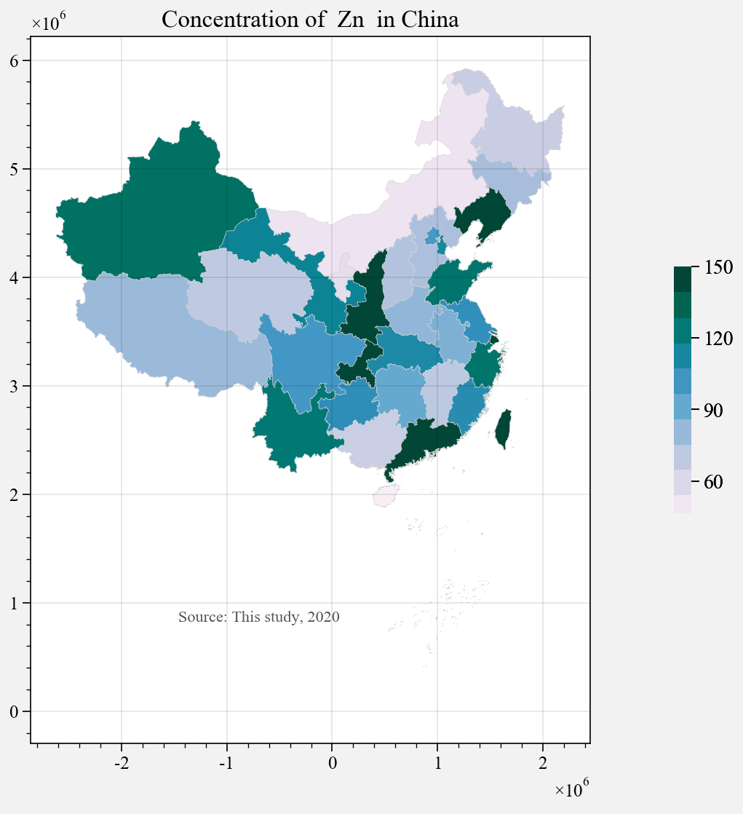
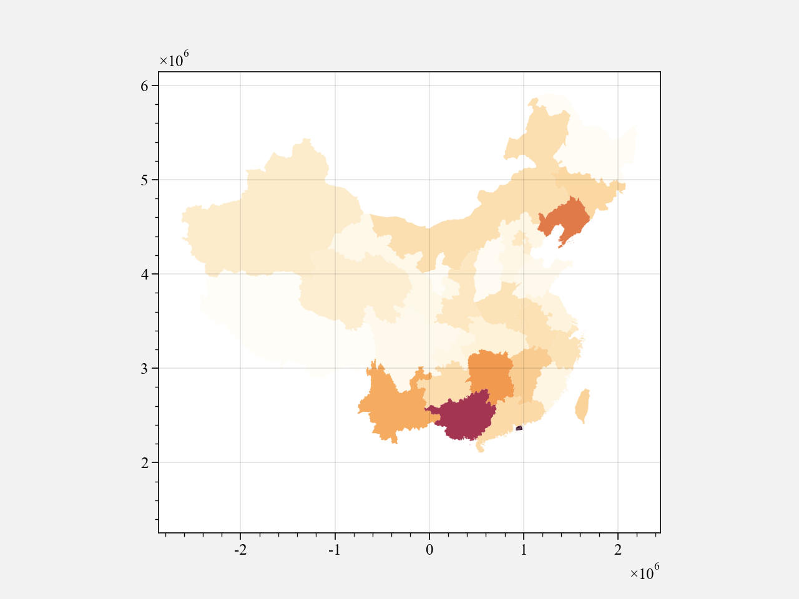
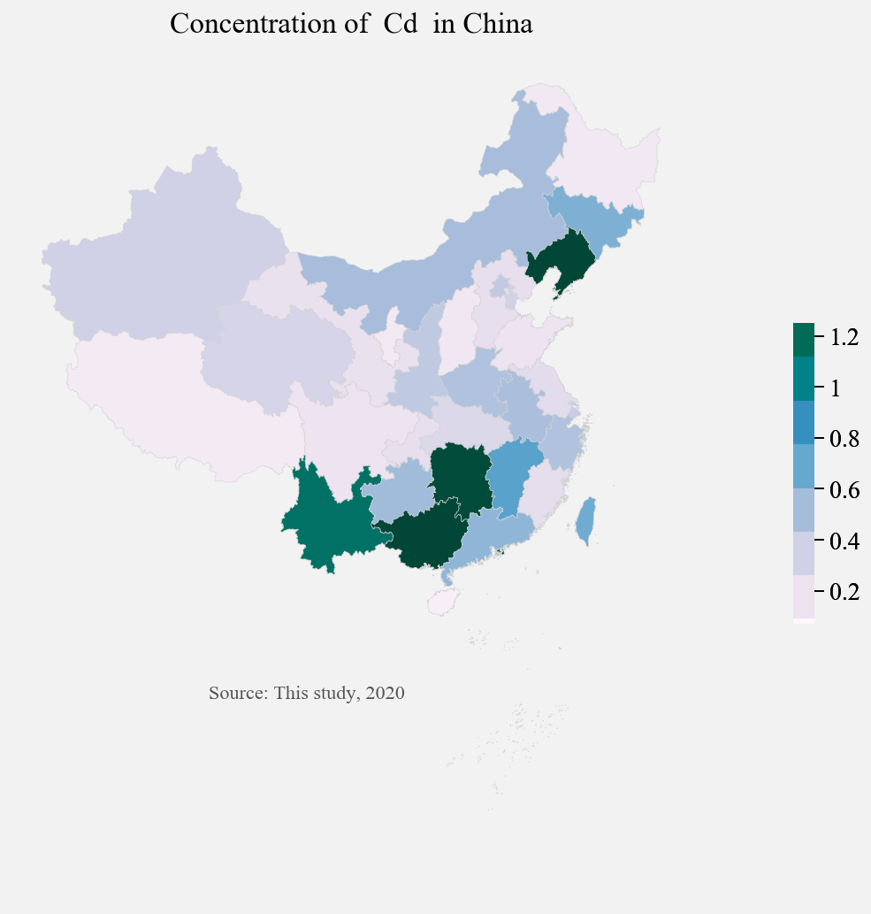
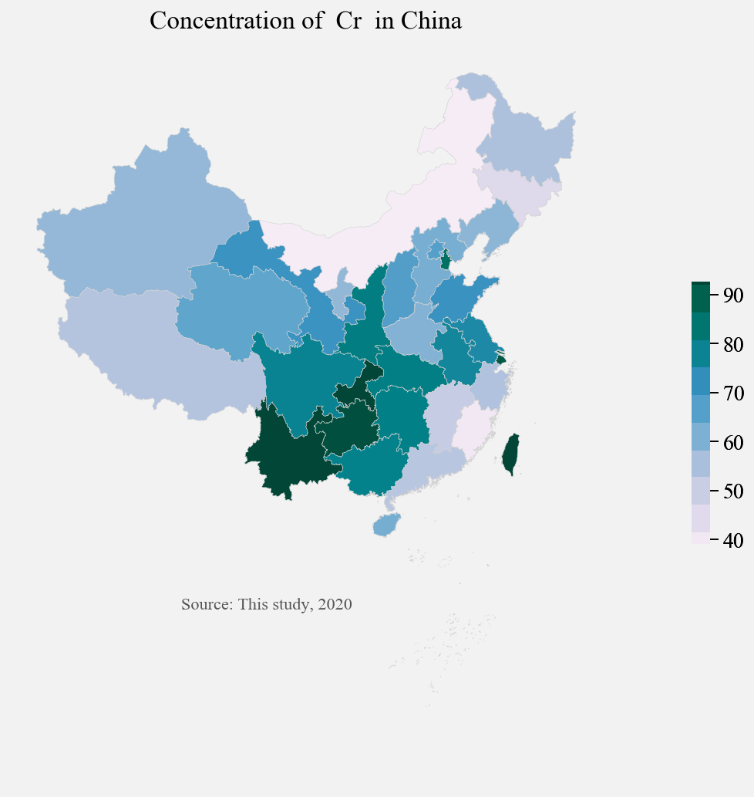
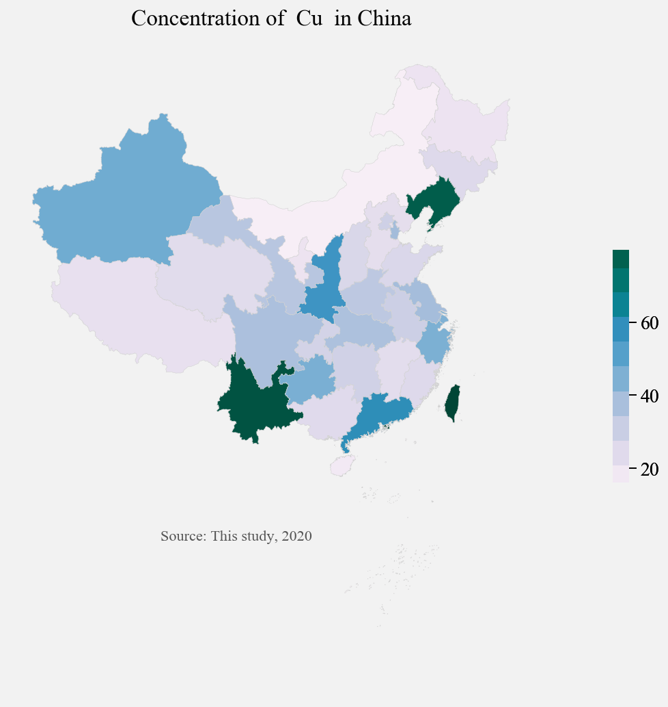
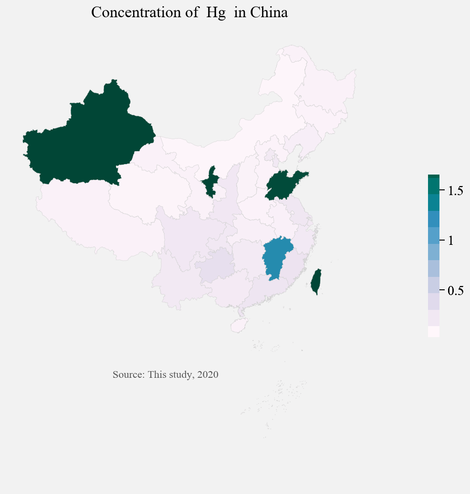
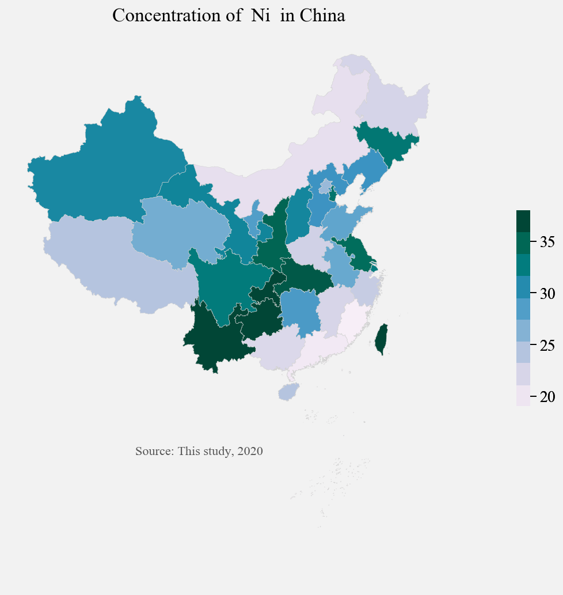
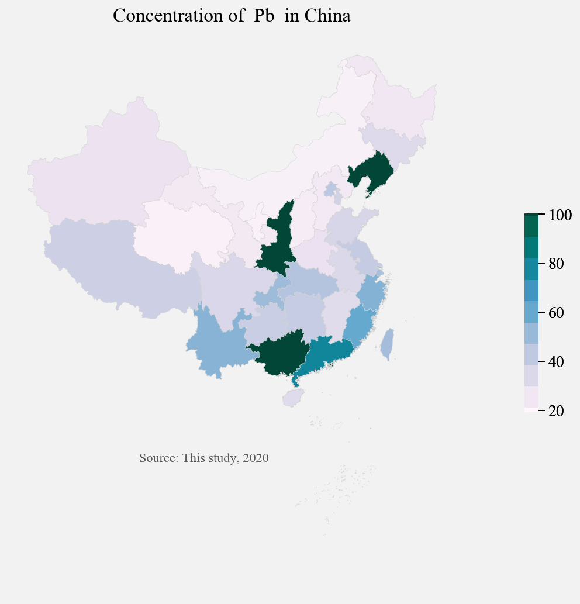
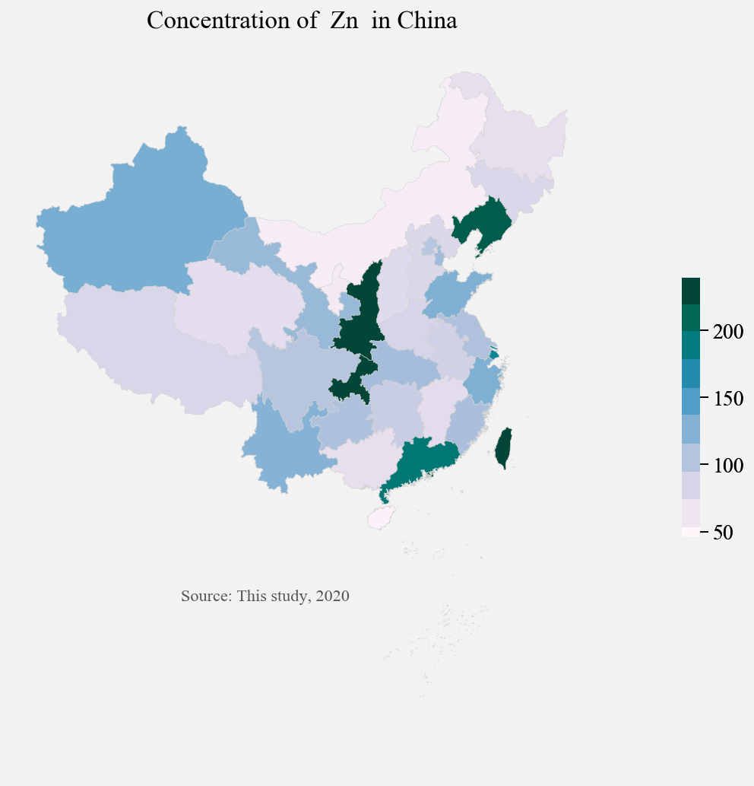

```python
import pandas as pd
import geopandas as gp
import pandas as pd
import HM.gplot as gplot
import proplot as plot
import numpy as np
#import proplot as plot
import re
import seaborn as sns
import matplotlib.pyplot as plt
%matplotlib inline
```


```python
df=pd.read_csv('融合数据集V1各省平均.csv')
dfmean=df[['Province', 'Cd', 'Cr', 'Cu', 'Hg', 'Ni', 'Pb', 'Zn']]
dfmean.head()
```


<div>
<style scoped>
    .dataframe tbody tr th:only-of-type {
        vertical-align: middle;
    }

    .dataframe tbody tr th {
        vertical-align: top;
    }

    .dataframe thead th {
        text-align: right;
    }
</style>
<table border="1" class="dataframe">
  <thead>
    <tr style="text-align: right;">
      <th></th>
      <th>Province</th>
      <th>Cd</th>
      <th>Cr</th>
      <th>Cu</th>
      <th>Hg</th>
      <th>Ni</th>
      <th>Pb</th>
      <th>Zn</th>
    </tr>
  </thead>
  <tbody>
    <tr>
      <th>0</th>
      <td>上海市</td>
      <td>0.374278</td>
      <td>91.441481</td>
      <td>44.562500</td>
      <td>0.155100</td>
      <td>33.560000</td>
      <td>47.598333</td>
      <td>183.425000</td>
    </tr>
    <tr>
      <th>1</th>
      <td>云南省</td>
      <td>1.134250</td>
      <td>102.168667</td>
      <td>80.666667</td>
      <td>0.158750</td>
      <td>45.766667</td>
      <td>54.314200</td>
      <td>128.233333</td>
    </tr>
    <tr>
      <th>2</th>
      <td>内蒙古自治区</td>
      <td>0.504371</td>
      <td>39.115333</td>
      <td>16.066667</td>
      <td>0.025733</td>
      <td>20.933333</td>
      <td>19.963333</td>
      <td>52.700000</td>
    </tr>
    <tr>
      <th>3</th>
      <td>北京市</td>
      <td>0.398738</td>
      <td>67.630093</td>
      <td>30.339969</td>
      <td>0.157855</td>
      <td>26.029444</td>
      <td>43.312751</td>
      <td>104.221759</td>
    </tr>
    <tr>
      <th>4</th>
      <td>台湾省</td>
      <td>0.652500</td>
      <td>195.442500</td>
      <td>142.150000</td>
      <td>2.675000</td>
      <td>94.552000</td>
      <td>49.168000</td>
      <td>414.208000</td>
    </tr>
  </tbody>
</table>
</div>


```python
DES=dfmean.describe(percentiles=[.2,.75, .9])
DES[-2:-1]
```


<div>
<style scoped>
    .dataframe tbody tr th:only-of-type {
        vertical-align: middle;
    }

    .dataframe tbody tr th {
        vertical-align: top;
    }

    .dataframe thead th {
        text-align: right;
    }
</style>
<table border="1" class="dataframe">
  <thead>
    <tr style="text-align: right;">
      <th></th>
      <th>Cd</th>
      <th>Cr</th>
      <th>Cu</th>
      <th>Hg</th>
      <th>Ni</th>
      <th>Pb</th>
      <th>Zn</th>
    </tr>
  </thead>
  <tbody>
    <tr>
      <th>90%</th>
      <td>1.25034</td>
      <td>92.59167</td>
      <td>79.806</td>
      <td>1.653977</td>
      <td>37.979585</td>
      <td>100.157023</td>
      <td>238.938</td>
    </tr>
  </tbody>
</table>
</div>


```python

#%config InlineBackend.figure_format = 'svg'
#%matplotlib inline
#plt.rcParams['font.sans-serif']=['FangSong_GB2312']
plt.rc('font',family='Times New Roman')
plt.rcParams['axes.unicode_minus'] = False

nine_lines = gp.GeoDataFrame.from_file('shapefiles/china_nine_dotted_line.shp',
                          encoding='utf-8')


china_geod = gp.GeoDataFrame.from_file('shapefiles/china.shp', encoding ='utf_8_sig')# 'utf-8')#'gb18030')
#china_geod.plot()#查看地图
china_geod = china_geod.rename(index = str, columns = {'FCNAME':'Province'})

```


```python

```


```python
geodf = gp.GeoDataFrame(dfmean)##将data转换为geopandas.DataFrame
GEODF = china_geod.merge(dfmean, on = 'Province', how = 'left')#数据合并
```


```python
albers_proj = '+proj=aea +lat_1=25 +lat_2=47 +lon_0=105'
fig, axs = plot.subplots(axwidth=1.1)
ax,m=gplot.plot_DF(GEODF.to_crs(albers_proj),ax=axs,column='Zn', cmap='PuBuGn',vmax=150,
                        linewidth = 0.2,edgecolor='lightgrey')
ax = nine_lines.geometry.plot(ax=ax,edgecolor='grey',
                                                      linewidth=0.2,
                                                      alpha=0.2)
ax.axis('off')
cbar=fig.colorbar(m, width=0.05,length=0.35,ticks=30, loc='r',linewidth=None)
cbar.outline.set_visible(False)
cbar.ax.tick_params(labelsize=2)

ax.set_title("Concentration of  "+'Zn'+'  in China', fontdict={'fontsize': '3', 'fontweight': '3'})
    # create an annotation for the data source
ax.annotate('Source: This study, 2020',xy=(0.24, 0.25),  xycoords='figure fraction', horizontalalignment='left', verticalalignment='top', fontsize=2, color='#555555')
fig.savefig('fig/'+"Zn2"+'.jpg',dpi=1000,bbox_inches = 'tight')
```

    C:\Users\Lenovo\AppData\Roaming\Python\Python37\site-packages\matplotlib\colors.py:527: RuntimeWarning: invalid value encountered in less
      xa[xa < 0] = -1
    C:\Users\Lenovo\AppData\Roaming\Python\Python37\site-packages\matplotlib\colors.py:527: RuntimeWarning: invalid value encountered in less
      xa[xa < 0] = -1
    





```python
albers_proj = '+proj=aea +lat_1=25 +lat_2=47 +lon_0=105'
fig, axs = plot.subplots(axwidth=5)
ax,m=gplot.plot_DF(GEODF.to_crs(albers_proj),ax=axs,column='Zn', cmap='PuBuGn',vmax=150,
                        linewidth = 0.2,edgecolor='lightgrey')
ax = nine_lines.geometry.plot(ax=ax,edgecolor='grey',
                                                      linewidth=0.2,
                                                      alpha=0.2)
#ax.axis('off')
cbar=fig.colorbar(m, width=0.12,length=0.35,ticks=30, loc='r',linewidth=None)
cbar.outline.set_visible(False)
cbar.ax.tick_params(labelsize=10)

ax.set_title("Concentration of  "+'Zn'+'  in China', fontdict={'fontsize': '12', 'fontweight': '3'})
    # create an annotation for the data source
ax.annotate('Source: This study, 2020',xy=(0.24, 0.25),  xycoords='figure fraction', horizontalalignment='left', verticalalignment='top', fontsize=8, color='#555555')
#fig.savefig('fig/'+"Zn2"+'.jpg',dpi=1000,bbox_inches = 'tight')
```

    C:\Users\Lenovo\AppData\Roaming\Python\Python37\site-packages\matplotlib\colors.py:527: RuntimeWarning: invalid value encountered in less
      xa[xa < 0] = -1
    


    Text(0.24, 0.25, 'Source: This study, 2020')


    C:\Users\Lenovo\AppData\Roaming\Python\Python37\site-packages\matplotlib\colors.py:527: RuntimeWarning: invalid value encountered in less
      xa[xa < 0] = -1
    





```python
fig, axs = plt.subplots()
GEODF.to_crs(albers_proj).plot('Cd',ax=axs)
```


    <matplotlib.axes._subplots.AxesSubplot at 0x14fdc418fd0>





```python
Max=DES[-2:-1].values[0]
Max
```


    array([  1.25034   ,  92.59166993,  79.806     ,   1.65397667,
            37.97958515, 100.15702273, 238.938     ])


```python
key=['Cd', 'Cr', 'Cu', 'Hg', 'Ni', 'Pb', 'Zn']
Max=DES[-2:-1].values[0]

for i,j in zip(key,range(len(key))):
    
    albers_proj = '+proj=aea +lat_1=25 +lat_2=47 +lon_0=105'
    fig, axs = plot.subplots(axwidth=5)
    Vmax=round(Max[j],3)
    ax,m=gplot.plot_DF(GEODF.to_crs(albers_proj),ax=axs,column=i, cmap='PuBuGn',vmax=Vmax,
                            linewidth = 0.2,edgecolor='lightgrey')
    ax = nine_lines.geometry.plot(ax=ax,edgecolor='grey',
                                                          linewidth=0.2,
                                                          alpha=0.2)
    ax.axis('off')
    cbar=fig.colorbar(m, width=0.12,length=0.35, loc='r',linewidth=None)
    cbar.outline.set_visible(False)
    cbar.ax.tick_params(labelsize=10)

    ax.set_title("Concentration of  "+i+'  in China', fontdict={'fontsize': '12', 'fontweight': '3'})
        # create an annotation for the data source
    ax.annotate('Source: This study, 2020',xy=(0.24, 0.25),  xycoords='figure fraction', horizontalalignment='left', verticalalignment='top', fontsize=8, color='#555555')
    fig.savefig('fig/'+i+'.jpg',dpi=1000,bbox_inches = 'tight')
```

    C:\Users\Lenovo\AppData\Roaming\Python\Python37\site-packages\matplotlib\colors.py:527: RuntimeWarning: invalid value encountered in less
      xa[xa < 0] = -1
    C:\Users\Lenovo\AppData\Roaming\Python\Python37\site-packages\matplotlib\colors.py:527: RuntimeWarning: invalid value encountered in less
      xa[xa < 0] = -1
    C:\Users\Lenovo\AppData\Roaming\Python\Python37\site-packages\matplotlib\colors.py:527: RuntimeWarning: invalid value encountered in less
      xa[xa < 0] = -1
    C:\Users\Lenovo\AppData\Roaming\Python\Python37\site-packages\matplotlib\colors.py:527: RuntimeWarning: invalid value encountered in less
      xa[xa < 0] = -1
    C:\Users\Lenovo\AppData\Roaming\Python\Python37\site-packages\matplotlib\colors.py:527: RuntimeWarning: invalid value encountered in less
      xa[xa < 0] = -1
    C:\Users\Lenovo\AppData\Roaming\Python\Python37\site-packages\matplotlib\colors.py:527: RuntimeWarning: invalid value encountered in less
      xa[xa < 0] = -1
    C:\Users\Lenovo\AppData\Roaming\Python\Python37\site-packages\matplotlib\colors.py:527: RuntimeWarning: invalid value encountered in less
      xa[xa < 0] = -1
    C:\Users\Lenovo\AppData\Roaming\Python\Python37\site-packages\matplotlib\colors.py:527: RuntimeWarning: invalid value encountered in less
      xa[xa < 0] = -1
    C:\Users\Lenovo\AppData\Roaming\Python\Python37\site-packages\matplotlib\colors.py:527: RuntimeWarning: invalid value encountered in less
      xa[xa < 0] = -1
    C:\Users\Lenovo\AppData\Roaming\Python\Python37\site-packages\matplotlib\colors.py:527: RuntimeWarning: invalid value encountered in less
      xa[xa < 0] = -1
    C:\Users\Lenovo\AppData\Roaming\Python\Python37\site-packages\matplotlib\colors.py:527: RuntimeWarning: invalid value encountered in less
      xa[xa < 0] = -1
    C:\Users\Lenovo\AppData\Roaming\Python\Python37\site-packages\matplotlib\colors.py:527: RuntimeWarning: invalid value encountered in less
      xa[xa < 0] = -1
    C:\Users\Lenovo\AppData\Roaming\Python\Python37\site-packages\matplotlib\colors.py:527: RuntimeWarning: invalid value encountered in less
      xa[xa < 0] = -1
    C:\Users\Lenovo\AppData\Roaming\Python\Python37\site-packages\matplotlib\colors.py:527: RuntimeWarning: invalid value encountered in less
      xa[xa < 0] = -1
    























```python
len(key)
```


    7


```python
for i,j in zip(key,range(len(key))):
    print(i,j)

```

    Cd 0
    Cr 1
    Cu 2
    Hg 3
    Ni 4
    Pb 5
    Zn 6
    


```python

```
